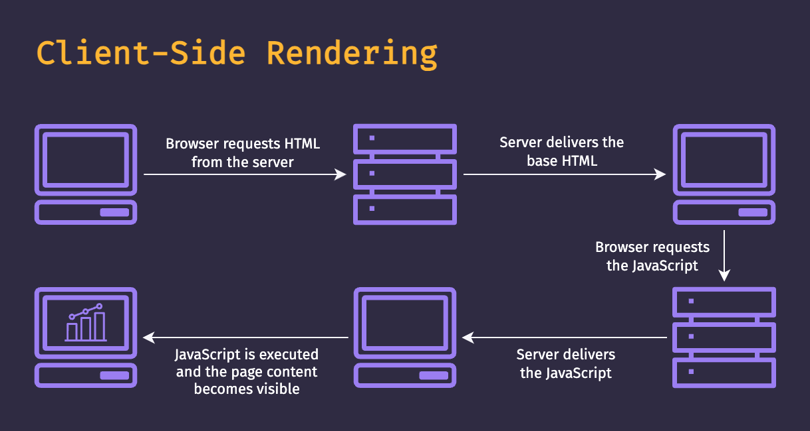
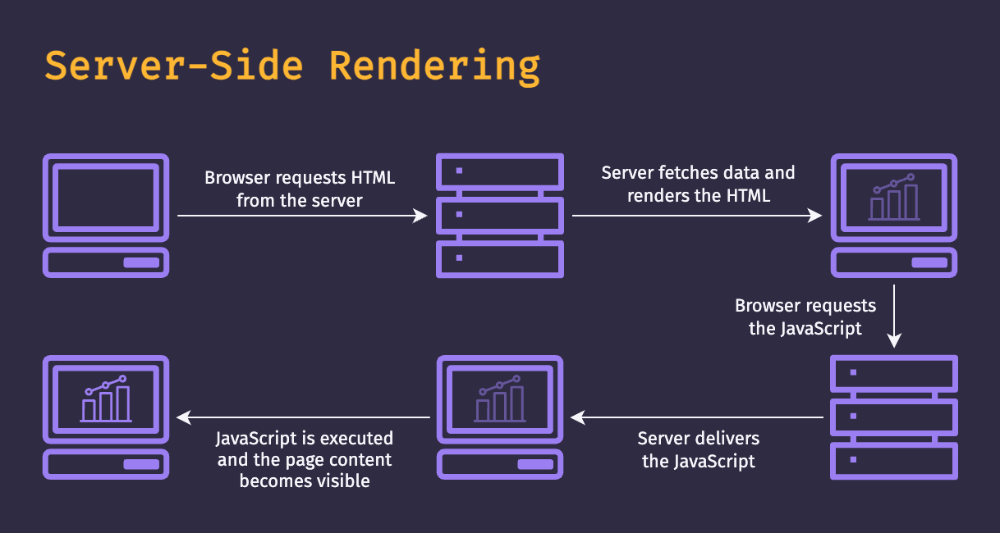
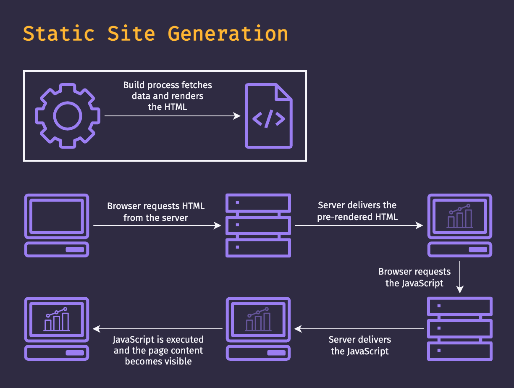
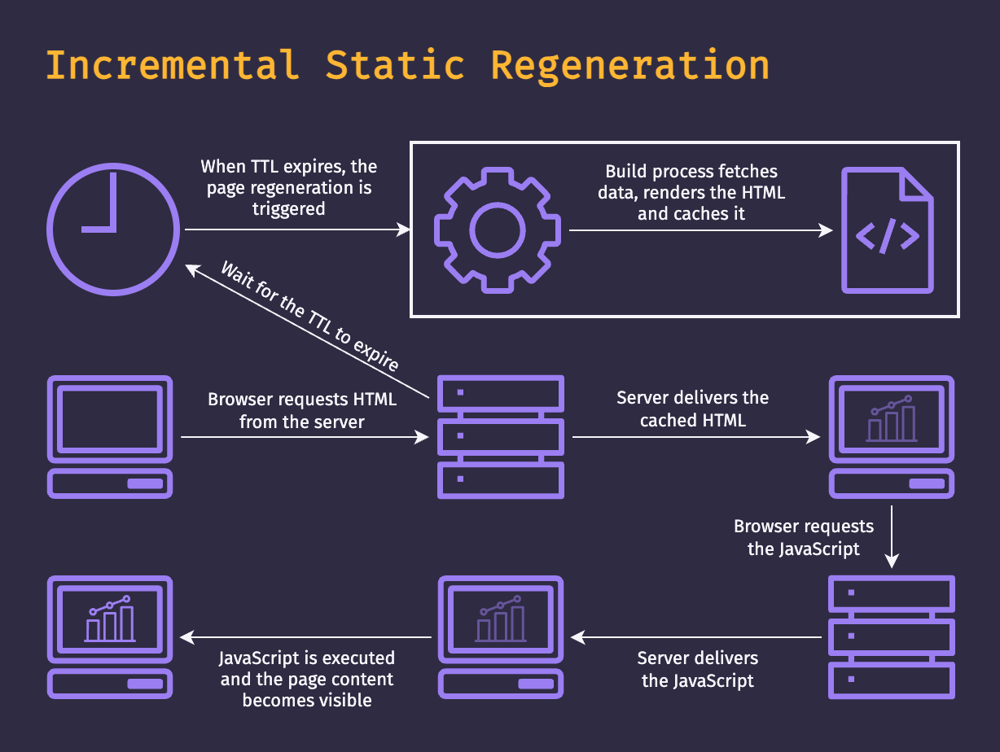

In this article, we will explore the different **rendering modes** for a web application, commonly seen in meta-frameworks like **Next.js** and **Nuxt**. Understanding these modes is **crucial** for developers seeking to **optimize performance** and **user experience**.

For demonstration purposes, we will use a project I've developed in Nuxt 3, which makes it easier to see the differences between the rendering modes.

## Client-Side Rendering (CSR)

Modern JavaScript libraries and frameworks like **Vue.js** and **React.js** brought many improvements to the front-end ecosystem, such as **easier componentization** and a **reactivity system**, but they also introduced their own challenges.

When we talk about **Client-Side Rendering** **(CSR)**, it's how those frameworks typically operate **by default**. Rendering occurs entirely on the **client-side**, within the browser. This means that the server delivers a **blank page** and then the **JavaScript** needs to be downloaded and executed to **render the UI** to the user. Consequently, there's a period during which the user sees **no content**, which can vary based on the user's network speed and hardware.

In addition to the **poor user experience** inherent in this rendering mode, **SEO** is also impacted because web crawlers must **wait for the page to be fully rendered** before they can index it.

This mode is also commonly referred to as **SPA (Single Page Application)**.

**Pros:**

- Lesser complexity
- Can be hosted on a static server

**Cons:**

- Blank page while JavaScript is not executed
- Bad for SEO

### Demonstration

<YouTube id="wYogjDe9YoA" caption="CSR demonstration — blank-page delay before JS executes." number={1} />

## Server-Side Rendering (SSR)

The meta-frameworks were created to mainly solve that problem. When we talk about "meta-framework", it usually means a framework that is built on top of another, providing further abstraction and tools. For example, **Next.js** is a meta-framework for **React.js** and **Nuxt** is a meta-framework for **Vue.js**.

How they solve that problem is by introducing **Server-Side Rendering (SSR)**. When the browser requests a page from the server, instead of the server responding with a **blank page**, it runs the framework on the **server-side** to **render the page**. This means that the user doesn't see a blank page anymore, but a **fully-rendered page** without executing any JavaScript on the browser.

Of course, that page is completely static, so there's **no interactivity**. The process of turning the static page into an interactive page is called **hydration**. Basically, what this means is that the framework is run again on the browser side, so it **binds all the** **event listeners** in the DOM and makes the page **interactive**.

An important point to understand is that usually, our **API calls** need to be made on the **server** so that the data is present to **render the page**. The meta-frameworks usually introduce some sort of **hook or function** that makes all those requests run on the server and not be duplicated in the client.

**Pros:**

- Good for SEO
- Page content available immediately

**Cons:**

- Greater complexity
- Needs a server with support
- Bigger processing cost

### Demonstration

<YouTube id="KrMVfwJ9MfM" caption="SSR demonstration — server renders the full page before responding." number={2} />

## Static Site Generation (SSG)

Another feature that the meta-frameworks introduced is **Static Site Generation (SSG)**. **Static** means that the page doesn't depend on any dynamic data.

For example, imagine a **profile page**. A profile page should not be static because the content of the page is different based on the user details. On the other hand, a page that describes the **terms and conditions** of your application is always going to be the same, because it doesn't have any dynamic data that needs to be fetched on the server-side.

For those cases, it's a good option to opt for **SSG**. Those pages are going to be **rendered at** **build time** and will not change, so the server uses **fewer resources** to deliver those pages to the client.

**Pros:**

- Good for SEO
- Page content available immediately
- Can be hosted on a static server

**Cons:**

- Greater complexity
- Limitation with dynamic route parameters
- Dynamic content not updated after build

### Demonstration

<YouTube id="Uh7mBQL0FIE" caption="SSG demonstration — page served from a pre-rendered static file." number={3} />

## Incremental Static Regeneration (ISR)

The last option and the most recent one introduced by meta-frameworks is **Incremental Static Regeneration (ISR)**. One easy way to describe it is that it is a mix of **SSR** and **SSG** because it **renders the page**, **caches it**, and **revalidates it** after a specific time interval.

For example, imagine a page with the most recent blog posts. New posts aren't created every second, so it makes sense to **render the page**, **cache it**, and after 1 minute **re-render the page**. While the **TTL (Time To Live)** doesn't expire, the server will deliver the cached page.

When using **ISR**, it's up to you to define the TTL of the page, so choose a setting that makes sense for the page in question.

Other terms that may be used are: **Incremental Static Generation (ISG)** and **Stale-While-Revalidate (SWR)**.

**Pros:**

- Good for SEO
- Page content available immediately
- Smaller processing cost when compared to SSR

**Cons:**

- Greater complexity
- Needs a server with support

### Demonstration

<YouTube id="iNC9fqek8wk" caption="ISR demonstration — cached page served until TTL expires, then regenerated." number={4} />

## Project

As I've mentioned at the beginning of the article, this is the project I've used to demonstrate the rendering modes:

**Website:** [https://renderingmodes.andresilva.cc/](https://renderingmodes.andresilva.cc/)
**Repository:** [https://github.com/andresilva-cc/demo-nuxt3-rendering-modes](https://github.com/andresilva-cc/demo-nuxt3-rendering-modes)
